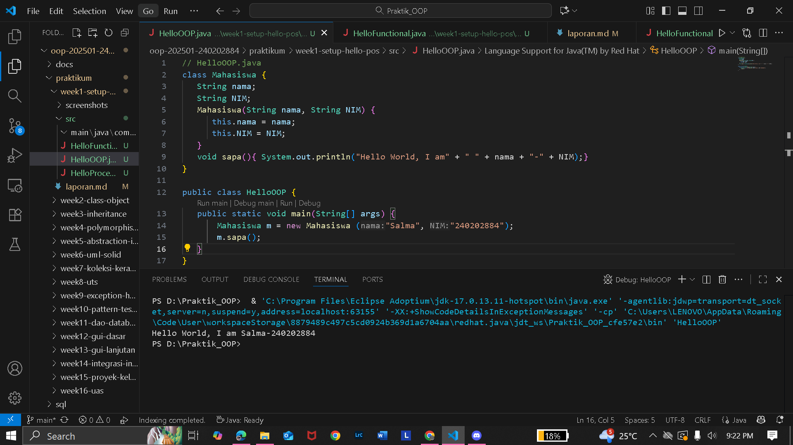
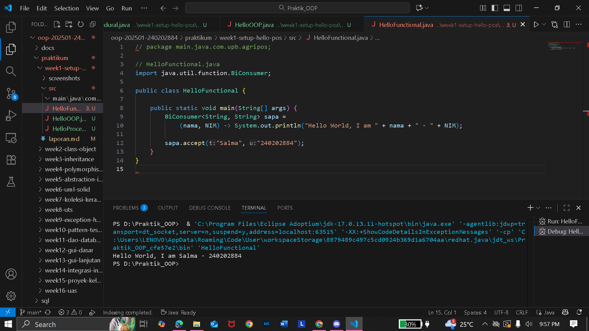

# Laporan Praktikum Minggu 1 (sesuaikan minggu ke berapa?)
Topik: ["Paradigma Setup"]

## Identitas
- Nama  : [Salma Zaidah]
- NIM   : [240202884]
- Kelas : [3IKRB]

---

## Tujuan
( Mahasiswa telah memahami konsep class dan object, serta mampu membuat class Produk dengan menerapkan prinsip enkapsulasi.)

---

## Dasar Teori
(  
1. Class merupakan cetak biru (blueprint) dari suatu objek, sedangkan object adalah instansiasi nyata dari class tersebut. 
2. Object adalah instansiasi dari class.  
3. Procedural: menulis langkah-langkah secara berurutan (menggunakan fungsi atau prosedur).
4. OOP: menggunakan class dan object untuk mengorganisasi kode.
5. Functional: menggunakan fungsi lambda expression dan functional interface seperti BiConsumer untuk menulis kode yang lebih ringkas dan modular.
6. Pemrograman OOP dan fungsional mendorong pembuatan kode yang terpisah ke dalam class atau fungsi agar mudah dibaca, dikelola, serta digunakan ulang (reusability).)


---

## Langkah Praktikum
1. **Setup Project**
   - Pastikan sudah menginstall **JDK** (Java Development Kit), **IDE** (misal: IntelliJ IDEA, VS Code, NetBeans), **Git**, **PostgreSQL**, dan **JavaFX** di komputer.
   - Buat folder project `oop-pos-<nim>`.
   - Inisialisasi repositori Git.
   - Buat struktur awal `src/main/java/com/upb/agripos/`.
   - Pastikan semua tools dapat berjalan (uji dengan membuat dan menjalankan program Java sederhana).

2. **Program Sederhana dalam 3 Paradigma**
   - Prosedural: program untuk menghitung total harga dua produk.
   - OOP: class `Produk` dengan atribut nama dan harga, buat minimal tiga objek, lalu hitung total.  
   - Fungsional: gunakan `Stream` atau lambda untuk menghitung total harga dari minimal tiga objek.  

3. **Commit dan Push**
   - Commit dengan pesan: `week1-setup-hello-pos`.  

---

## Kode Program 
(
```java
package main.java.com.upb.agripos;

// HelloFunctional.java
import java.util.function.BiConsumer;

public class HelloFunctional {
    public static void main(String[] args) {
        BiConsumer<String, String> sapa =
            (nama, nim) -> System.out.println("Hello World, I am " + nama + " - " + nim);
        
        sapa.accept("Salma", "240202884");
    }
}

```
)
---

## Hasil Eksekusi

1. [Screenshots hasil] 
2. [Screenshots hasil] 
3. [Screenshots hasil] 
---

## Analisis
(
- Jelaskan bagaimana kode berjalan.
   Pada praktikum ini, program dijalankan dengan pendekatan fungsional (functional programming) menggunakan lambda expression dan higher-order function seperti BiConsumer. Kode bekerja dengan cara mendefinisikan fungsi sapa yang menerima dua parameter, yaitu nama dan NIM, kemudian mencetak pesan “Hello World, I am <nama>-<NIM>” ke layar. Fungsi tersebut dipanggil melalui sapa.accept("Salma", "240202884"), sehingga eksekusi program menjadi lebih ringkas tanpa perlu mendefinisikan class atau method tambahan.
- Apa perbedaan pendekatan minggu ini dibanding minggu sebelumnya.  
   Pendekatan ini berbeda dari minggu sebelumnya, yang menggunakan paradigma OOP (Object-Oriented Programming) dengan pembuatan class Produk dan enkapsulasi atribut seperti nama dan harga. Jika pada OOP setiap data dan perilaku dikemas dalam objek, pada fungsional program lebih menekankan fungsi sebagai entitas utama untuk mengolah data.
- Kendala yang dihadapi dan cara mengatasinya. 
   Kendala yang dihadapi selama praktikum ini adalah kesalahan sintaks pada penulisan lambda dan penggunaan BiConsumer, terutama karena Java memiliki aturan ketat pada format argumen dan pemanggilan fungsi. Kendala ini dapat diatasi dengan mempelajari dokumentasi java.util.function dan memahami cara kerja ekspresi lambda agar sesuai dengan tipe data dan parameter yang digunakan.
)
---

## Kesimpulan
(Dengan menggunakan paradigma fungsional, program menjadi lebih ringkas dan efisien karena logika dapat ditulis dalam bentuk fungsi yang dapat digunakan kembali tanpa perlu membuat banyak class atau metode tambahan.
Pendekatan ini juga meminimalkan kode berulang dan membuat program lebih mudah dibaca serta dikelola dibanding pendekatan prosedural atau OOP pada kasus sederhana.)

---

## Quiz
(1. [Apakah OOP selalu lebih baik dari prosedural?]  
   **Jawaban:** tidak selalu. Pemrograman berorientasi objek (Object-Oriented Programming/OOP) tidak bisa dianggap selalu lebih baik daripada pemrograman prosedural, karena keduanya memiliki kekuatan dan kelemahan masing-masing yang sesuai dengan kebutuhan serta karakteristik proyek yang dikerjakan. 

2. [Kapan functional programming lebih cocok digunakan dibanding OOP atau prosedural?]  
   **Jawaban:** Functional programming lebih cocok digunakan ketika program berfokus pada pengolahan data tanpa mengubah nilai aslinya (stateless), karena pendekatan ini membuat kode lebih ringkas, mudah dibaca, dan aman dijalankan secara paralel tanpa menimbulkan konflik data. 

3. [Bagaimana paradigma (prosedural, OOP, fungsional) memengaruhi maintainability dan scalability aplikasi?]  
   **Jawaban:** Paradigma pemrograman memengaruhi maintainability dan scalability aplikasi melalui cara kode diorganisasi dan dikembangkan. Pemrograman prosedural cenderung mudah dipahami untuk program kecil, tetapi sulit dikembangkan karena logika bercampur dan sulit diubah. Pemrograman berorientasi objek (OOP) meningkatkan maintainability dan scalability dengan memecah program menjadi class dan objek yang terstruktur, sehingga mudah diperluas dan dimodifikasi tanpa mengubah keseluruhan sistem. Sedangkan fungsional membuat kode lebih ringkas, modular, dan bebas side effect, sehingga memudahkan pengujian serta meningkatkan skalabilitas pada pemrosesan data besar dan paralel.
   
4. [Mengapa OOP lebih cocok untuk mengembangkan aplikasi POS dibanding prosedural?] 
   **Jawaban:** OOP lebih cocok untuk mengembangkan aplikasi POS karena dapat memodelkan komponen nyata seperti produk, pelanggan, dan transaksi dalam bentuk class dan object, sehingga kode menjadi lebih terstruktur, mudah dikembangkan, serta mendukung pemeliharaan dan penambahan fitur baru tanpa mengubah keseluruhan sistem.
   
5. [Bagaimana paradigma fungsional dapat membantu mengurangi kode berulang (boilerplate code)?]
   **Jawaban:** Paradigma fungsional membantu mengurangi kode berulang dengan memanfaatkan higher-order function dan lambda expression, di mana logika program dapat ditulis satu kali lalu digunakan kembali melalui fungsi-fungsi bawaan seperti map(), filter(), dan forEach(), sehingga kode menjadi lebih ringkas, konsisten, serta mudah dibaca dan dikelola. )
