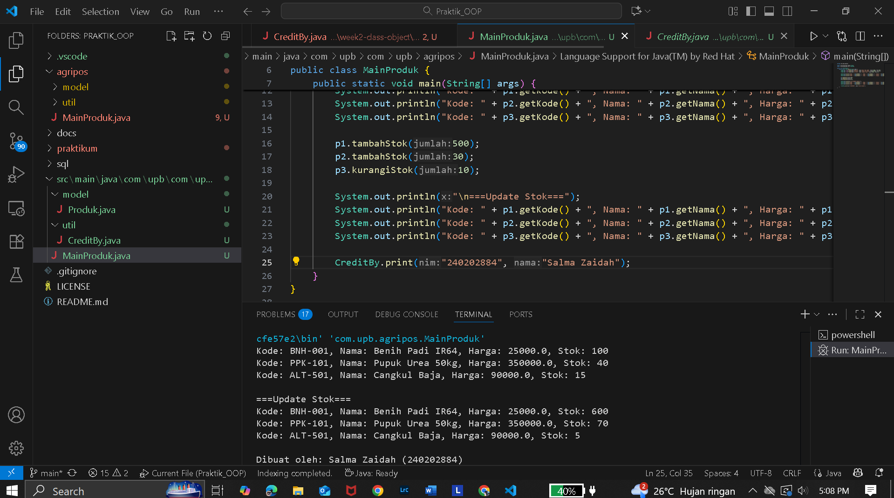

# Laporan Praktikum Minggu 1 (sesuaikan minggu ke berapa?)
Topik: ["Class dan Object (Produk Pertanian)"]

## Identitas
- Nama  : [Salma Zaidah]
- NIM   : [240202884]
- Kelas : [3 IKR B]

---

## Tujuan
(Mahasiswa mampu menjelaskan konsep class, object, atribut, dan method dalam OOP.
Mahasiswa mampu menerapkan access modifier dan enkapsulasi dalam pembuatan class.
Mahasiswa mampu mengimplementasikan class Produk pertanian dengan atribut dan method yang sesuai.
Mahasiswa mampu mendemonstrasikan instansiasi object serta menampilkan data produk pertanian di console.
Mahasiswa mampu menyusun laporan praktikum dengan bukti kode, hasil eksekusi, dan analisis sederhana.)

---

## Dasar Teori
(Tuliskan ringkasan teori singkat (3–5 poin) yang mendasari praktikum.  
1. Class bisa diibaratkan sebagai rancangan atau cetak biru dari sebuah objek.  
2. Objek merupakan hasil nyata (instansiasi) dari class yang punya atribut berupa data dan method sebagai perilakunya.   
3. Enkapsulasi digunakan untuk menjaga keamanan data dengan menyembunyikan atribut menggunakan access modifier seperti public, private, atau protected, lalu diakses lewat getter dan setter.
4. Dalam konteks Agri-POS, produk pertanian seperti benih, pupuk, dan alat pertanian bisa direpresentasikan sebagai objek dengan atribut seperti nama, harga, dan stok.
5. Dengan menerapkan konsep class, setiap produk bisa dibuat, dikelola, dan diubah dengan cara yang lebih teratur dan efisien. )

---

## Langkah Praktikum
(Tuliskan Langkah-langkah dalam prakrikum
1. Membuat Class Produk
-Buat file Produk.java pada package model.
-Tambahkan atribut: kode, nama, harga, dan stok.
-Gunakan enkapsulasi dengan menjadikan atribut bersifat  private dan membuat getter serta setter untuk masing-masing atribut.  
2. Membuat Class CreditBy
-Buat file CreditBy.java pada package util.
-Isi class dengan method statis untuk menampilkan identitas mahasiswa di akhir output: credit by: <NIM> - <Nama>.  
3. Membuat Objek Produk dan Menampilkan Credit
-Buat file MainProduk.java.
-Instansiasi minimal tiga objek produk, misalnya "Benih Padi", "Pupuk Urea", dan satu produk alat pertanian.
-Tampilkan informasi produk melalui method getter.
-Panggil CreditBy.print("<NIM>", "<Nama>") di akhir main untuk menampilkan identitas.
4. Commit dan Push
-Commit dengan pesan: week2-class-object. )

---

## Kode Program
(Tuliskan kode utama yang dibuat, contoh:  

```java
package com.upb.agripos;

import com.upb.agripos.model.Produk;
import com.upb.agripos.util.CreditBy;

public class MainProduk {
    public static void main(String[] args) {
        Produk p1 = new Produk("BNH-001", "Benih Padi IR64", 25000, 100);
        Produk p2 = new Produk("PPK-101", "Pupuk Urea 50kg", 350000, 40);
        Produk p3 = new Produk("ALT-501", "Cangkul Baja", 90000, 15);

        System.out.println("Kode: " + p1.getKode() + ", Nama: " + p1.getNama() + ", Harga: " + p1.getHarga() + ", Stok: " + p1.getStok());
        System.out.println("Kode: " + p2.getKode() + ", Nama: " + p2.getNama() + ", Harga: " + p2.getHarga() + ", Stok: " + p2.getStok());
        System.out.println("Kode: " + p3.getKode() + ", Nama: " + p3.getNama() + ", Harga: " + p3.getHarga() + ", Stok: " + p3.getStok());

        p1.tambahStok(500);
        p2.tambahStok(30);
        p3.kurangiStok(10);

        System.out.println("\n===Update Stok===");
        System.out.println("Kode: " + p1.getKode() + ", Nama: " + p1.getNama() + ", Harga: " + p1.getHarga() + ", Stok: " + p1.getStok());
        System.out.println("Kode: " + p2.getKode() + ", Nama: " + p2.getNama() + ", Harga: " + p2.getHarga() + ", Stok: " + p2.getStok());
        System.out.println("Kode: " + p3.getKode() + ", Nama: " + p3.getNama() + ", Harga: " + p3.getHarga() + ", Stok: " + p3.getStok());

        CreditBy.println("<240202884>", "<Salma Zaidah>");
    }
}

```
)
---

## Hasil Eksekusi
(Sertakan screenshot hasil eksekusi program.  

)
---

## Analisis
(
- Jelaskan bagaimana kode berjalan.  
Program pada praktikum ini diawali dengan pembuatan class Produk yang berisi atribut kode, nama, harga, dan stok. Setiap atribut disembunyikan menggunakan access modifier private, lalu diakses melalui getter dan setter sesuai prinsip enkapsulasi. Pada class MainProduk, beberapa objek Produk dibuat, lalu dilakukan operasi seperti menambah dan mengurangi stok untuk menunjukkan interaksi antar objek.
- Apa perbedaan pendekatan minggu ini dibanding minggu sebelumnya.  
Perbedaan dengan minggu sebelumnya terletak pada penggunaan paradigma Object-Oriented Programming (OOP). Jika pada minggu sebelumnya pendekatannya masih prosedural (mengandalkan fungsi-fungsi terpisah), minggu ini sudah berfokus pada pemodelan data dan perilaku ke dalam bentuk class dan objek, sehingga kode lebih terstruktur dan mudah dikembangkan.
- Kendala yang dihadapi dan cara mengatasinya.  
Kendala yang dihadapi selama praktikum ini adalah kesalahan struktur folder dan package yang menyebabkan program tidak bisa dijalankan. Masalah tersebut diatasi dengan menyesuaikan nama package agar sesuai dengan struktur direktori proyek Java di VS Code.
)
---

## Kesimpulan
(Tuliskan kesimpulan dari praktikum minggu ini.  
Dengan menerapkan konsep class dan object, program menjadi lebih terstruktur, mudah dipahami, dan fleksibel untuk dikembangkan. Melalui penerapan enkapsulasi, data dalam objek dapat dijaga keamanannya sekaligus tetap bisa diakses dengan cara yang terkontrol. Pendekatan OOP pada praktikum ini juga membuat pengelolaan produk dalam sistem Agri-POS menjadi lebih efisien dibandingkan pendekatan prosedural.

Secara keseluruhan, praktikum ini membantu mahasiswa memahami dasar pemrograman berorientasi objek serta penerapannya dalam membangun sistem yang lebih terorganisir dan mudah dikembangkan di masa mendatang.)

---

## Quiz
(1. [Mengapa atribut sebaiknya dideklarasikan sebagai private dalam class?]  
   **Jawaban:** Atribut sebaiknya dideklarasikan sebagai private supaya data di dalam class tidak bisa diakses atau diubah secara langsung dari luar class. Dengan begitu, kita bisa mengontrol bagaimana data tersebut digunakan melalui getter dan setter. 
   Kalau atribut dibiarkan public, kode di luar class bisa bebas mengubah nilainya tanpa aturan — misalnya stok jadi negatif atau harga jadi nol. Dengan private, kita menjaga keamanan data (data hiding) dan memastikan perubahan hanya dilakukan dengan cara yang benar.

2. [Apa fungsi getter dan setter dalam enkapsulasi?]  
   **Jawaban:** Fungsi getter dan setter dalam enkapsulasi adalah untuk memberikan akses yang terkontrol terhadap atribut yang bersifat private. Getter digunakan untuk mengambil nilai atribut, sedangkan setter digunakan untuk mengubah nilainya dengan cara yang aman dan sesuai aturan yang ditentukan di dalam class. 

3. [Bagaimana cara class Produk mendukung pengembangan aplikasi POS yang lebih kompleks?]  
   **Jawaban:** Class Produk mendukung pengembangan aplikasi POS yang lebih kompleks karena menjadi dasar untuk merepresentasikan data produk secara terstruktur seperti kode, nama, harga, dan stok sehingga mudah dikelola, diperluas, dan diintegrasikan dengan fitur lain seperti transaksi penjualan, laporan, atau manajemen inventori. 
   Dengan adanya class Produk, sistem bisa dikembangkan tanpa harus mengubah logika utama, cukup menambah method atau class baru sesuai kebutuhan aplikasi POS-nya. )
