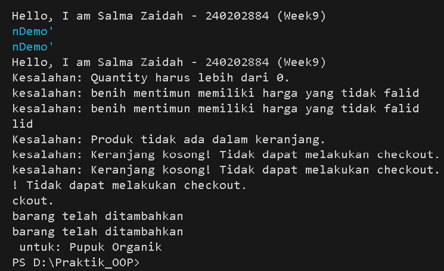

# Laporan Praktikum Minggu 9 
Topik: [Exception Handling, Custom Exception, dan Design Pattern Sederhana]

## Identitas
- Nama  : [Salma Zaidah]
- NIM   : [240202884]
- Kelas : [3 IKR B]

---

## Tujuan
(
1. Menjelaskan perbedaan antara error dan exception.
2. Mengimplementasikan try–catch–finally dengan tepat.
3. Membuat custom exception sesuai kebutuhan program.
4. Mengintegrasikan exception handling ke dalam aplikasi sederhana (kasus keranjang belanja).
5. (Opsional) Menerapkan design pattern sederhana (Singleton/MVC) dan unit testing dasar.
)

---

## Dasar Teori
(
1. Error merupakan kesalahan fatal yang umumnya tidak dapat ditangani oleh program.
2. Exception adalah kondisi tidak normal yang masih dapat ditangani menggunakan mekanisme try–catch.
3. Custom exception digunakan untuk merepresentasikan kesalahan bisnis yang spesifik.
4. Blok finally akan selalu dijalankan, baik terjadi exception maupun tidak.
5. Exception handling membantu meningkatkan keandalan dan keamanan aplikasi.
)

---

## Langkah Praktikum
(
1. Membuat beberapa class custom exception seperti InvalidQuantityException, ProductNotFoundException, InsufficientStockException, CartEmptyException, dan DuplicateProductException.
2. Mengimplementasikan validasi pada class ShoppingCart menggunakan exception handling.
3. Menguji seluruh custom exception melalui class MainExceptionDemo.
4. Menjalankan program dan mengamati pesan kesalahan yang ditampilkan.
5. Melakukan commit dan push ke repository GitHub
)

---

## Kode Program
(Tuliskan kode utama yang dibuat, contoh:  

```java
package main.java.com.upb.agripos;

public class MainExceptionDemo {
    public static void main(String[] args) throws InvalidQuantityException {
        System.out.println("Hello, I am Salma Zaidah - 240202884 (Week9)");

        ShoppingChart cart = new ShoppingChart();
        Product p1 = new Product("P01", "Pupuk Organik", 25000, 11);
        Product p2 = new Product("P02", "benih mentimun", -1000,20);

        try {
            cart.addProduct(p1, -1);
        } catch (Exception e) {
            System.out.println("Kesalahan: " + e.getMessage());
        }
        try {
            cart.addProduct(p2,2);
        } catch (Exception e) {
            System.out.println("kesalahan: "+ e.getMessage());
        }
        try {
            cart.removeProduct(p1);
        } catch (ProductNotFoundException e) {
            System.out.println("Kesalahan: " + e.getMessage());
        }

        try {
            cart.checkout();
        } catch (Exception e) {
            System.out.println("kesalahan: "+ e.getMessage());
        }


        try {
            cart.addProduct(p1, 20);
            cart.checkout();
        } catch (Exception e) {
            System.out.println("Kesalahan: " + e.getMessage());
        }
    }
}

```
)
---

## Hasil Eksekusi
(Sertakan screenshot hasil eksekusi program.  

)
---

## Analisis
(
1. Program berjalan dengan memvalidasi setiap operasi pada keranjang belanja.
2. Setiap kesalahan bisnis ditangani menggunakan custom exception yang sesuai.
3. Dibandingkan minggu sebelumnya, pendekatan ini lebih terstruktur karena kesalahan tidak lagi ditangani secara manual menggunakan if-else.
4. Kendala yang dihadapi adalah munculnya error Unhandled exception, yang diatasi dengan menambahkan blok catch yang sesuai.
)
---

## Kesimpulan
(
Dengan menerapkan exception handling dan custom exception, program menjadi lebih aman, terstruktur, dan mudah dikembangkan. Setiap kesalahan dapat ditangani secara spesifik sesuai kebutuhan bisnis pada sistem POS.
)

---

## Quiz
(
1. [Jelaskan perbedaan error dan exception.]  
   **Jawaban:** 
   Error adalah masalah serius yang terjadi di level sistem atau JVM yang umumnya tidak dapat ditangani oleh program (misalnya OutOfMemoryError, StackOverflowError). Error biasanya mengindikasikan kondisi fatal yang membuat aplikasi tidak dapat dilanjutkan.
   Exception adalah masalah yang terjadi selama eksekusi program yang masih dapat ditangani menggunakan mekanisme try-catch. Exception dibagi menjadi checked exception (harus ditangani) dan unchecked exception (RuntimeException). Pada kode Anda, InvalidQuantityException dan ProductNotFoundException adalah contoh exception yang dapat ditangani.

2. [Apa fungsi finally dalam blok try–catch–finally?]  
   **Jawaban:** 
   Blok finally berfungsi untuk mengeksekusi kode yang pasti akan dijalankan terlepas dari apakah exception terjadi atau tidak. Blok ini biasanya digunakan untuk:
   1. Menutup resource (file, database connection, stream)
   2. Membersihkan memori
   3. Logging
   4. Operasi cleanup lainnya

3. [Mengapa custom exception diperlukan?]  
   **Jawaban:** 
   Custom exception diperlukan untuk:
   1. Memberikan informasi error yang lebih spesifik sesuai konteks bisnis aplikasi
   2. Meningkatkan readability dan maintainability kode dengan nama exception yang deskriptif
   3. Memisahkan logika error handling berdasarkan jenis masalah yang terjadi
   4. Memudahkan debugging dengan pesan error yang lebih relevan dengan domain aplikasi

4. [Berikan contoh kasus bisnis POS yang membutuhkan     custom exception.] 
   **Jawaban:** 
   Berdasarkan kode AgriPOS Anda, beberapa contoh kasus bisnis yang membutuhkan custom exception:
   1. InvalidQuantityException - Ketika customer mencoba menambahkan produk dengan quantity negatif atau nol (terlihat di cart.addProduct(p1, -1))
   2. ProductNotFoundException - Ketika mencoba menghapus produk yang tidak ada di keranjang (terlihat di cart.removeProduct(p1))
   3. InvalidPriceException - Ketika harga produk negatif (terlihat di p2 dengan harga -1000)
   4. InsufficientStockException - Ketika quantity yang diminta melebihi stok tersedia (misalnya p1 stok 11, tapi customer pesan 20)
   5. EmptyCartException - Ketika mencoba checkout dengan keranjang kosong
   6. PaymentFailedException - Ketika proses pembayaran gagal
   Custom exception ini membuat error handling lebih terstruktur dan mudah dipahami dalam konteks sistem POS pertanian (AgriPOS). 
)
